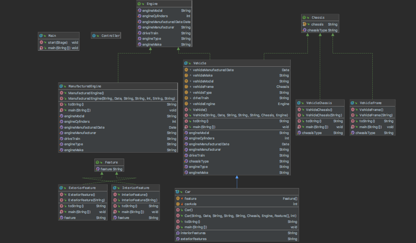

# Car Design
Designing a program using object-oriented programming to design a car and its features. 
This project was for COP 3003- Object-Oriented Programming with Professor Vanselow. It was part of a personal project assigment for Fall 2019. 

## Documentation

[JavaDoc](https://carolinabado17.github.io/ppCar/)

## Diagrams

## Built With

* IntelliJ IDE     

## Author

* Carolina Bado-Cortes

## License

https://github.com/carolinabado17/ppCar/blob/master/LICENSE.txt 

## Acknowledgments

* StackOverflow - toString()

## History

10/20 - Worked on the interfaces Chassis and Feature  
10/27 - Implemented the Chassis interface into VehicleChassis() and VehicleFrame() 
11/10 - Created the Engine interfaces and implemented it to ManufacturedEngine() 
11/24 - Implemented both Engine and Chassis to class Vehicle() 
12/1 - Implemented Feature into both ExteriorFeature() and InteriorFeature()  
12/8 - Finished the program by extending class Vehicle() to class Car() 

## Key Programming Concepts Utilized

Interfaces - its basically a 'contract' *NOT* a blueprint like a class. Used to be able to implement to multiple classes in my program.  
Abstract class - class in which you are unable to create an object. This was used to to extends Vehicle to Car becaue these two are somewhat related. (A car is a vehicle) 

